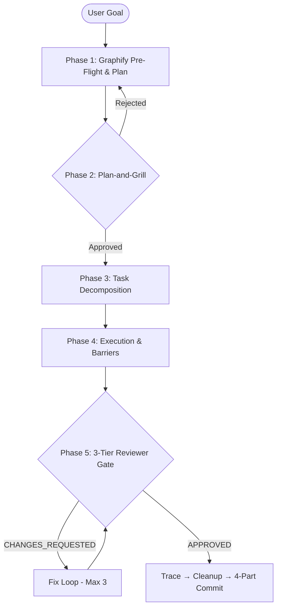

# Frontend SWE Team Orchestrator Skill

> Scaffolded by the Bootstrap Engine (AGENTS.md §3, Step 4).
> All universal protocols inherited from [AGENTS.md](../../AGENTS.md).

Use this skill when implementing new features, UI components, reactive state, or bug fixes within the **Finace.Client** Angular application.

---

## The 5-Phase Execution Pipeline



---

## Phase 1: Pre-Flight & Plan Generation

1. **Checkpoint Check**: Inspect `.agents/memory/active-task.json` (AGENTS.md §2.7). Resume if exists; initialize new otherwise.
2. **Graphify Blast Radius**: `graphify query` / `graphify path` to trace dependents.
3. **Consult Knowledge**: Scan `.agents/knowledge/` for known traps.
4. **Formulate Plan**: Smart/Dumb split, signal mapping, API endpoints, responsive breakpoints, `@defer` targets.

## Phase 2: Plan-and-Grill (AGENTS.md §2.1)

Orchestrator interrogates the plan as a strict senior Angular architect:
- Graph coverage of all downstream dependents?
- OnPush + signal-first reactivity? (per `angular-signals-onpush.md`)
- Zero template function calls? All `@for` tracked?
- Contract barrier scheduled if `swagger.json` changed?
- Design system compliance? (monochrome, 8px grid, 44×44px targets)

**Verdict**: REJECT with counter-examples, or APPROVE to proceed.

## Phase 3: Task Decomposition

| Mode | Criteria |
| :--- | :--- |
| **`[SEQUENTIAL]`** | Dependent steps — downstream cannot compile without upstream. |
| **`[PARALLEL]`** | Independent components, dialogs, pipes, or tests with no shared collisions. |

## Phase 4: Execution & Barriers

1. **Contract Barrier**: If `swagger.json` updated → `npm run generate-api` must pass before frontend tasks proceed.
2. **Sequential dispatch**: State services → Smart containers.
3. **Parallel dispatch**: Dumb components, dialogs, spec files.
4. **Circuit Breaker**: Max 3 failures → halt and escalate (AGENTS.md §2.5).
5. **Coder Pre-Checks (AGENTS.md §2.10)**: Ponytail Ladder, state reflex, template reflex, styling reflex, surgical scope reflex.

## Phase 5: 3-Tier Binary Reviewer Gate

### Tier 1: Build & Test Gate (Fail Fast)
```bash
npm run build
npm test -- --watch=false --browsers=ChromeHeadless
```
If either fails → `CHANGES_REQUESTED` with compiler traceback.

### Tier 2: 4-Pillar Audit (AGENTS.md §1, Role 5)
1. **Industry Standards**: OnPush, Smart/Dumb separation, zero `any`, inject() DI.
2. **LOC Reduction**: 7-Rung Ladder applied, dead code removed.
3. **Performance**: Zero in-place mutations, zero template functions, tracked `@for`, `@defer`.
4. **Security**: Zero `[innerHTML]`/`bypassSecurityTrust*`, explicit error handling, no hardcoded secrets.

### Tier 3: Completion Protocol
- If rejected → drop-in diff snippet, max 3 iterations.
- If approved → execute completion per AGENTS.md §2.7, §2.11, §2.14:
  trace → cross-task log → clear checkpoint → 4-part commit.
